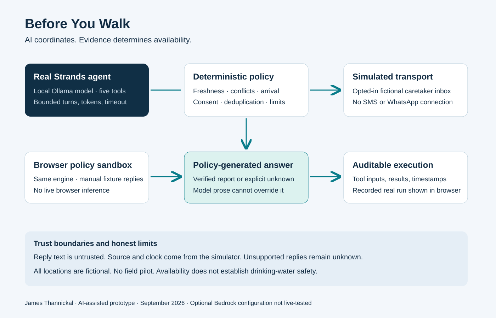

# Before You Walk

A community verification prototype for the **AWS Agents for Humans — Good Neighbor Agents** track.

Before someone spends time walking to a water point, check whether its availability report is still trustworthy. If a closer point is uncertain, ask its opted-in caretaker; do not invent an answer.

**Prototype only:** all ten locations, walking estimates, reports, contacts, and replies are fictional. No SMS, WhatsApp, or community deployment is connected. Availability is not a water-quality assessment. No actual trips, money, or health outcomes have been measured.

## Try it two ways

1. **Interactive policy sandbox:** the browser runs deterministic rules and lets the viewer play a simulated caretaker. It does NOT run a live LLM. State is held in memory and resets on reload. It requires connectivity for its initial assets; this is not a fully offline/PWA implementation.
2. **Real Strands agent:** `npm run agent` invokes the Strands SDK with a local Ollama model. The model uses five tools to inspect evidence, request confirmation, read a fixture reply, record its interpretation, and retrieve a policy-generated answer. The saved trace is shown as a recorded run in the browser, never mislabeled live.

## Run

Requires Node.js 22.13+ and npm. Node 22 LTS is recommended and was used for the verified static build. On this Windows host, Node 24.15.0 completed export but crashed during native-tool shutdown; Node 22 exited successfully.

```sh
npm ci
npm test
npm run typecheck
npm run dev
```

To export the public static sandbox, run `npm run build` with Node 22. Serve `dist/client` with a static web server. The local agent remains a separate process; the static site does not expose inference.

Use the exact Local URL printed by the server (the port may differ if occupied).

For real agent inference, install Ollama from its official distribution and obtain a tool-capable model. The verified run used `gemma4:12b-it-qat` (approximately 7.2 GB of weights). This compute is a development/community-gateway requirement, NOT a claim that it runs on a basic shared phone.

```sh
ollama pull gemma4:12b-it-qat
npm run agent
```

Ollama must be listening on `127.0.0.1:11434`. The adapter uses its OpenAI-compatible endpoint; no OpenAI account or API key is involved. The model is not included in this repository and has its own license. Set `BYW_MODEL` to select another locally installed tool-capable model. Model portability is not equivalent to a passed evaluation.

The run writes `public/evidence/strands-run.json`. It contains only this fictional dataset and tool events. The CLI exits nonzero if it did not successfully record a reply. Read the trace, not only the model narrative, to verify execution.

### Optional Bedrock mode (not yet live-tested)

Set `BYW_PROVIDER=bedrock`, `AWS_REGION`, and optionally `BYW_MODEL` after configuring authorized AWS credentials and model access through the normal AWS SDK credential chain. `npm run agent` then uses `BedrockModel`. This may incur charges. No credentials belong in the code, public site, or repository. AgentCore deployment has not been implemented or claimed.

## How it works



- Freshness: reports expire at 60 minutes (an illustrative policy, not field validated).
- Arrival check: evidence must remain fresh through estimated walking time. Queue/service time is not covered.
- Source: only a fresh caretaker report can establish verified availability. A newer or simultaneous conflicting report blocks it until a newer caretaker response.
- Messaging: only opted-in fictional caretakers; deduplication; three requests per demo session; 15-minute reply timeout. No bulk external messaging.
- Replies: request identity and timestamp are owned by the simulator, not the LLM. A bounded tool accepts only evidence read from that request's fixture.
- Interpretation: the prototype deliberately accepts a narrow English reply grammar. Unclear, unsupported-language, or instruction-like messages remain unknown. It is not a general multilingual parser.
- Output: the answer exposed to the user is computed by the deterministic policy. Free-form model narration cannot override status, consent, or freshness.
- Budget: agent inference has a 12-turn, 4,000-output-token soft limit and a four-minute cancellation deadline.

## Tests and evaluation

`npm test` covers freshness/arrival boundaries, contradictions, timeout, consent, message limits, replay, quote/queue grounding, and instruction-like replies. Tests are synthetic unit tests, not evidence of field effectiveness. `public/evidence/strands-run.json` is a real local inference trace, not a manually authored success record.

## Files

- `lib/engine.ts`: shared deterministic domain policy.
- `agent/runner.ts`: five Strands tools, grounded interpretation, bounded model execution.
- `agent/cli.ts`: runnable end-to-end agent and trace export.
- `app/page.tsx`: interactive policy sandbox and recorded trace viewer.
- `tests/`: reproducible unit tests.
- `public/architecture.svg`: submission diagram.

## Limitations and next validation step

The concept has not been co-designed with a community or piloted. Before deployment, interview prospective users and caretakers, select locally appropriate freshness rules and languages, implement verified opt-in identities, durable state, abuse controls, offline delivery, and a real message transport. Independently assess safe operation and how quickly reports become unreliable. Measure wasted-trip reduction only in an ethically conducted pilot. Do not collect precise household locations or health records for this prototype.

The browser sandbox is intentionally public-data-only with no server actions or external message endpoints. Local development tooling is not a production service. Do not expose a local inference endpoint to the internet.

## Credits

By James Thannickal, with OpenAI Codex assistance across development and submission preparation. Built with Strands Agents, React/Vinext, the OpenAI Sites scaffold, shadcn/Base UI, Lucide, and Zod. Third-party packages retain their own licenses.

Original project work began September 4, 2026. MIT license applies to project-authored code; dependencies and model weights are governed separately.
